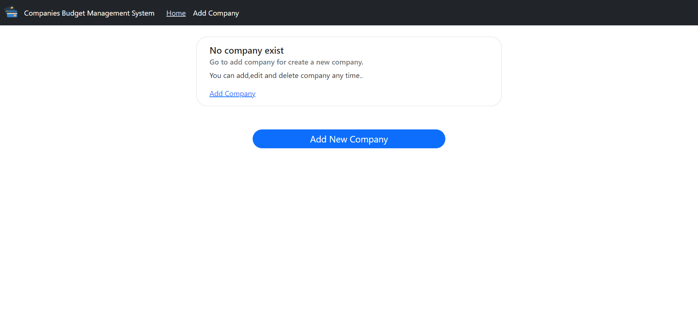
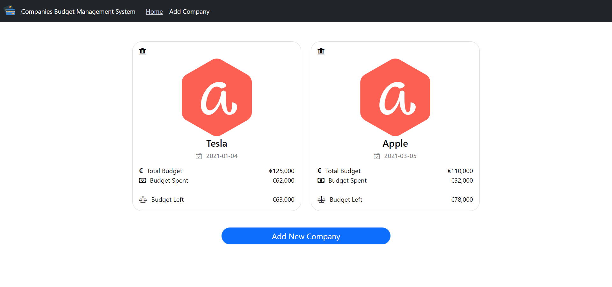
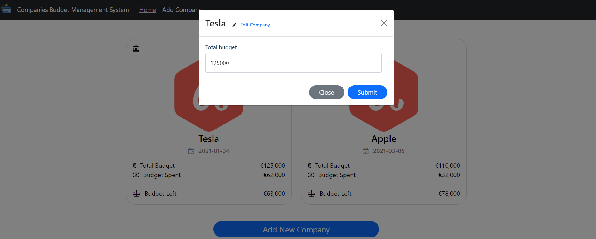
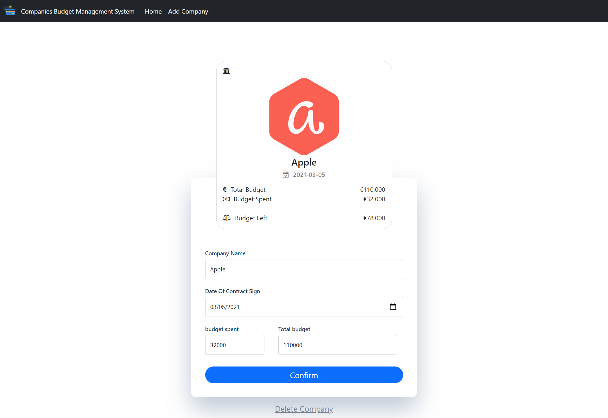
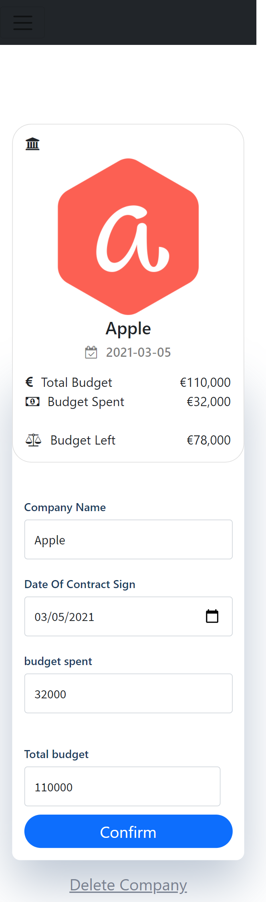
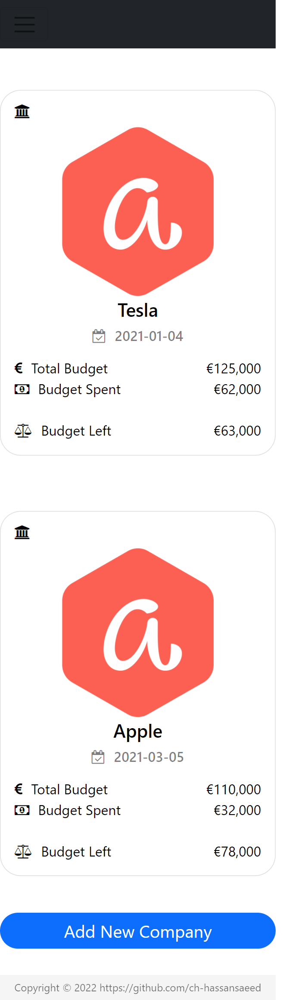

# companies budget management System

A companies budget management System - CBMS build with react, typescript, bootstrap, sass, react-transition, font-awesome

## Demo video

**Project Demo Video :-**

**demo_video.mp4**

#### Run:

### `npm install`

### `npm start`

http://localhost:3000

## Demo Snapshots

# `Home Page`

# `Listing Page`

# `Edit Budget`

# `Add Company`

# `Edit Company`

# `Mobile Layout Form`

# `Mobile Listing Page`

## Unit Test Cases using react-testing-library

\_\_tests\_\_/Company.test.js

## Future Work Improvements

- Integrate API layer if need to link with any restful/graphql API
- Form fields Validation using Regex
- add helper or common class
